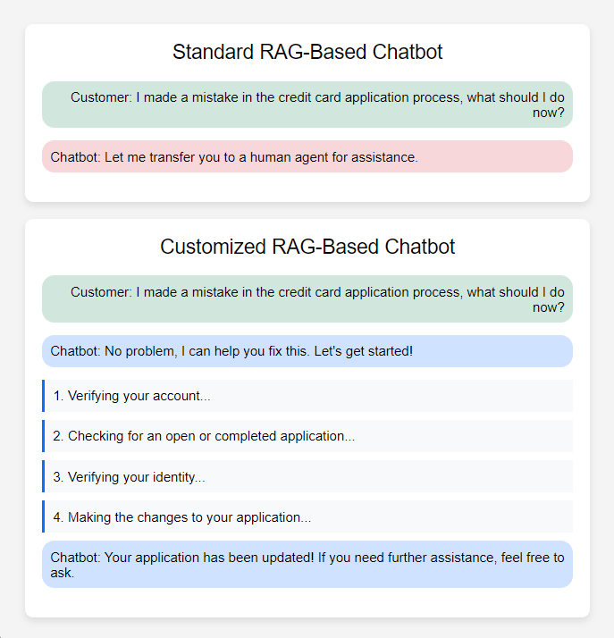

    <h1>COT RAG-AI Integration: Maximize the Potential of RAG</h1>

    
:star: **Empowering AI Agents with human-like reasoning and chain-of-thought capabilities.** :star:

## Table of Contents
- [Introduction](#Introduction)
- [Features](#features)
- [Usage](#usage)
- [Installation](#installation)
- [License](#license)
- [Disclaimer](#Disclaimer)

# Introduction
Nowadays, companies have been introducing AI and various algorithms in the form of chatbots to enhance customer experience. Nevertheless, a noticeable and significant gap remains between chatbots and actual human agents. Specifically, chatbots often struggle with:
- Understanding complex or nuanced customer queries where they involve multiple decision trees.
- Handling unexpected or edge-case scenarios.
- Adapting to the context or history of customer interactions, a common limitation in traditional algorithm-driven chatbots.

This project addresses these challenges by developing a more comprehensive and responsive chatbot model. The solution integrates the capabilities of OpenAI's GPT-4o (recommended for its human-reasoning abilities) with a custom-built Retrieval-Augmented Generation (RAG) system, utilizing both the LangChain and LangGraph frameworks.

--
## Retrieval-Augmented Generation (RAG)
RAG is a commonly used technique that enhances the performance of language models like GPT-4 by accessing an external knowledge base.
This method offers several advantages:
- It improves the model's accuracy by retrieving relevant information at query time.
- It expands the model’s scope by allowing it to respond to a wide range of questions without needing to be fine-tuned on every possible piece of information.

--
## Customized RAG
In the world of RAG, there are numerous ways to implement RAG systems with models like GPT. This project showcases a custom RAG system developed using LangChain and LangGraph frameworks, which are optimized for building complex, reasoning-based workflows. The system leverages semantic search to handle intricate customer service queries that traditional models often struggle with.

### How It Works:

- **Customer Queries**: Customer queries—especially complex ones are encoded into semantic embeddings, which capture the meaning of the query rather than just the literal words.
  
- **Semantic Search**: The encoded query is used to perform a semantic similarity search in an external set of predefined workflows and solutions (not a traditional database but a collection of structured Standard Operating Procedures, or SOPs).

- **Workflows (SOPs)**: The retrieved results are associated with specific workflows (Standard Operating Procedures), which guide the model through the necessary steps to resolve the issue. These workflows are contextually related to the query and provide detailed procedural guidance to the chatbot.

The model doesn’t just provide static answers but also guides the customer through a dynamic process that adapts based on the query and user's responses.

### Features of Enhanced RAG-Based Model
- **Human-Like Reasoning (GPT-4o)**: The use of GPT-4o adds a layer of human-like reasoning that enables the chatbot to handle more complex queries. 
- **Reliability**: The chatbot is capable of adhering strictly to the predefined workflow (SOPs) like the standard algorithm-driven models.
- **Flexibility**: The combination of GPT-4o and custom-build RAG allows the model to adapt its responses based on the specific scenario, simulating human-like decision-making, especially when handling edge-case queries.
- **Scalability**: The system reduces the need for multiple specialized models. With the LangChain and LangGraph frameworks, the RAG system can retrieve the appropriate workflows for various queries, as long as the questions and flows are correctly imported.

## Frameworks and Tools Used
**GPT-4 (via OpenAI API)**:
GPT-4 was chosen for its advanced reasoning capabilities, making it especially suited for handling complex customer service queries.

**LangChain**:
LangChain integrates language models with external data sources, making it easier to build complex, multi-step reasoning workflows.

**LangGraph**:
LangGraph allows the creation of more sophisticated, graph-based workflows that provide better structure and flow control for the chatbot’s decision-making process.

# License
This project is licensed under the MIT License - see the [LICENSE](License) file for details.

# Disclaimer
The COT RAG System is intended for educational purposes only. The creator assumes no responsibility for any consequences arising from it use. Users are advised to comply with appropriate terms of service of relevant usage and adhere to all applicable laws, regulartions, and ethical guidlines.
